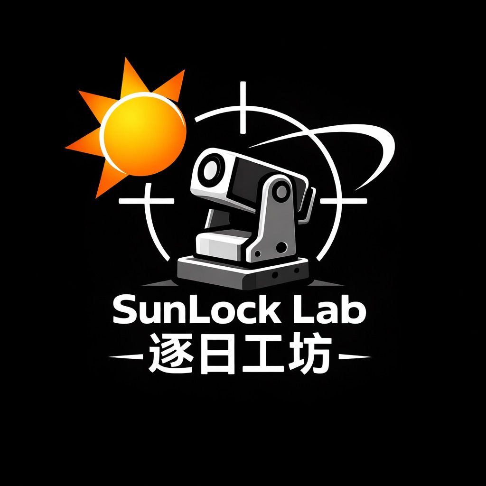
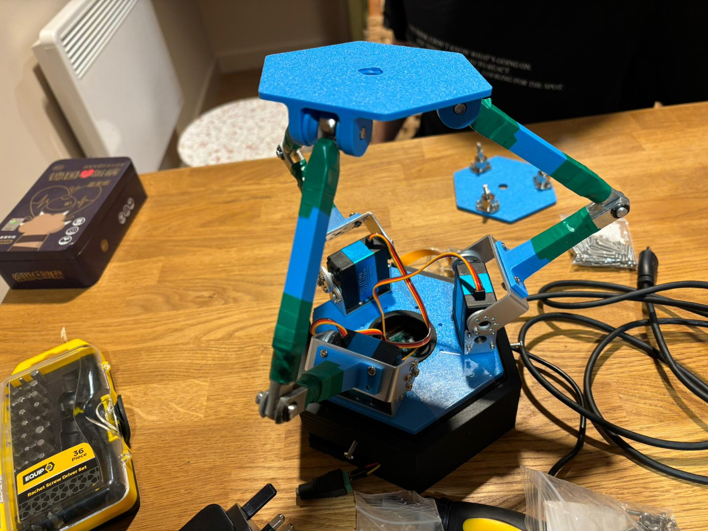
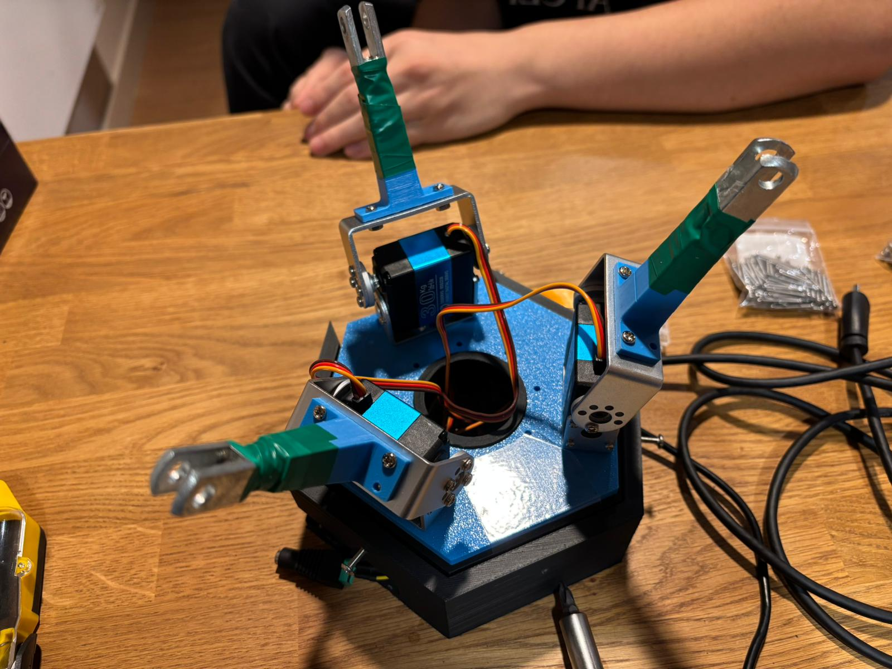
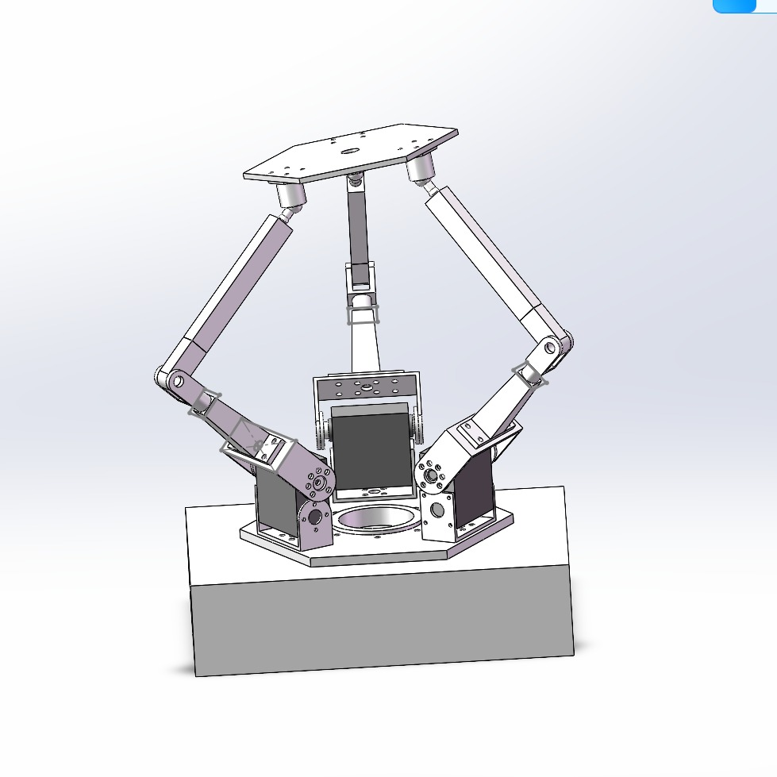
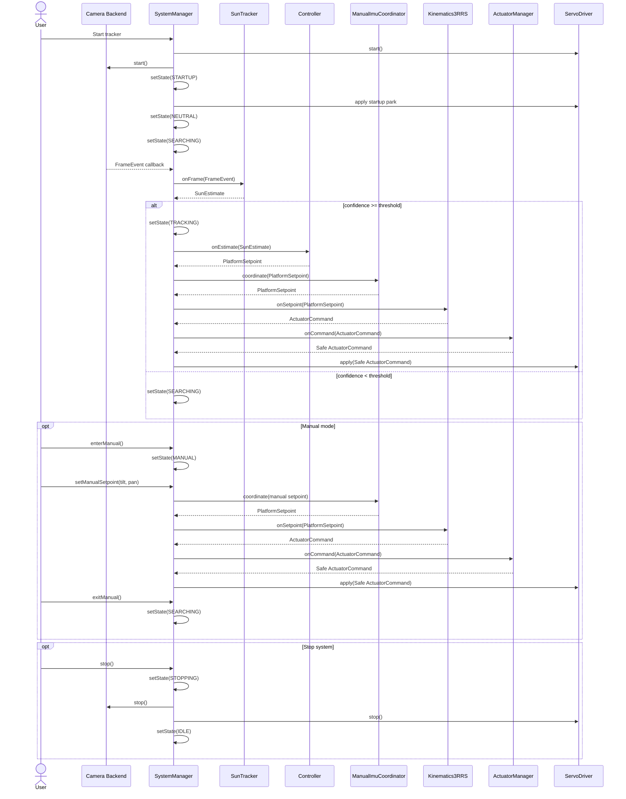
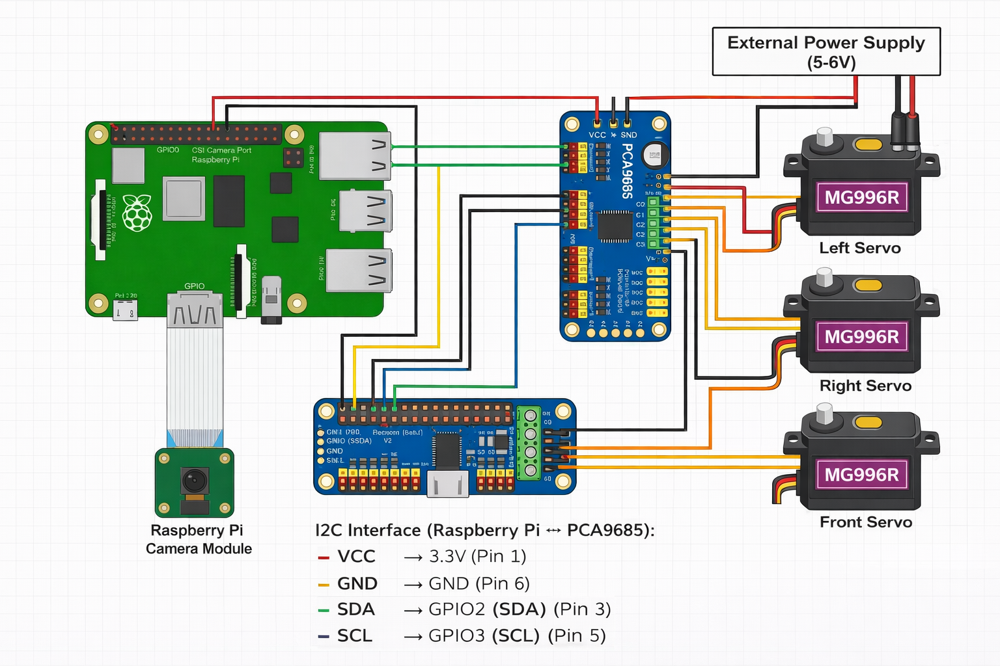

# SunLock Lab Solar Stewart Tracker

  

Real-time embedded C++17 software for solar tracking using a **3-RRS Stewart-type parallel mechanism** on **Raspberry Pi / Linux**.

This project implements an event-driven pipeline in which camera frames are delivered through callbacks, processed by vision and control modules, converted into platform motion through inverse kinematics, and safely applied to three actuators through a hardware abstraction layer. The runtime is structured around blocking waits, callback-driven stage transitions, bounded queues, and modular components so the software remains responsive, maintainable, testable, and reproducible.

  

  

  

## Table of Contents

- [Social Media](#social-media)
- [Project Overview](#project-overview)
- [Key Features](#key-features)
- [System Architecture](#system-architecture)
- [Sequence Diagram](#sequence-diagram)
- [Circuit Diagram](#circuit-diagram)
- [Repository Structure](#repository-structure)
- [Bill of Materials](#bill-of-materials)
- [Dependencies](#dependencies)
- [Cloning](#cloning)
- [Building](#building)
- [Running](#running)
- [Running Tests](#running-tests)
- [Realtime Evidence](#realtime-evidence)
- [Documentation](#documentation)
- [Authors and Contributions](#authors-and-contributions)
- [Acknowledgements](#acknowledgements)
- [License](#license)
- [Future Work](#future-work)

---

## Social Media

We actively document the development, testing, and realtime performance of the **Solar Stewart Tracker** to promote transparency, reproducibility, and engagement with the engineering community.

📌 **TikTok (Primary Platform)**  
https://www.tiktok.com/@sunlock.lab_2

Content includes:

- realtime tracking demonstrations
- hardware setup and wiring
- development progress updates
- testing and debugging clips

---

## Project Overview

The **Solar Stewart Tracker** is a Linux userspace realtime embedded system that:

- acquires camera frames from a camera backend
- detects the sun position using image processing
- computes tracking corrections
- converts desired motion into **3-RRS inverse kinematics**
- applies safety shaping before actuation
- drives three servo outputs through a PCA9685 PWM controller

The design goal is not only functional tracking, but tracking implemented in a way that is:

- **event-driven**
- **responsive**
- **modular**
- **testable**
- **reproducible**
- **safe for hardware control**

The main software path is:

**Camera → SunTracker → Controller → ManualImuCoordinator → Kinematics3RRS → ActuatorManager → ServoDriver**

---

## Key Features

- **Realtime event-driven processing**
  - callback-based frame delivery
  - blocking worker threads
  - no busy-wait control loop in the processing pipeline
  - no sleep-based timing in the control path

- **Modular C++17 architecture**
  - `SystemManager` orchestrates the runtime pipeline
  - hardware-facing and processing modules are separated by clear interfaces
  - optional backends and UI layers do not change the core architecture

- **Multiple build and use modes**
  - Linux / Raspberry Pi execution
  - software-only path with simulated camera input
  - headless CLI application
  - optional Qt GUI target

- **Safety-oriented actuation path**
  - actuator clamping
  - optional slew/rate limiting
  - neutral / park behaviour on start and stop
  - explicit handling of low-confidence tracking conditions
  - fault-driven suppression of invalid actuation commands

- **Engineering evidence built into the repository**
  - CMake-based build
  - CTest-integrated automated tests
  - latency measurement exported to artefacts
  - Doxygen-ready source tree
  - structured repository layout by subsystem

---

## System Architecture

  

The repository is organised around a staged runtime pipeline.

### Core modules

- **ICamera**  
  Abstract camera interface used by the system.

- **LibcameraPublisher**  
  Raspberry Pi / Linux camera backend when `libcamera` is available.

- **SimulatedPublisher**  
  Fallback or simulation camera backend.

- **SystemManager**  
  Top-level orchestrator for state, queues, callbacks, and worker threads.

- **SunTracker**  
  Vision module that finds the bright target and estimates sun position.

- **Controller**  
  Converts tracking error into platform tilt/pan setpoints.

- **ManualImuCoordinator**  
  Coordinates manual input ownership and optional IMU-based correction.

- **Kinematics3RRS**  
  Converts platform setpoints into actuator-space commands.

- **ActuatorManager**  
  Safety shaping layer for command limiting.

- **ServoDriver**  
  Final actuator output layer.

- **LatencyMonitor**  
  Measures timing across the userspace pipeline.

### Threading model

The runtime design uses separate responsibilities with blocking waits:

- **camera / backend context**: frame acquisition and callback delivery
- **control thread**: vision, control, coordination, and kinematics
- **actuator thread**: safety filtering and output application
- **main / event loop**: application lifecycle and optional UI / event handling

### Queue policy

Inter-stage communication uses bounded queues with a **freshest-data** policy:

- frame queue capacity: **1**
- command queue capacity: **1**

This avoids stale backlog and prioritises current data over historical frames.

---

## Sequence Diagram

Circuit Diagram

  

The hardware setup connects:

camera through a libcamera-compatible interface
PCA9685 PWM driver over I2C
three servo motors
Raspberry Pi acting as the central controller

The PCA9685 generates stable PWM signals for the servos, while I2C provides communication between the Raspberry Pi and the actuator driver layer.

Repository Structure

Solar-Stewart-Tracker/
├── .github/
│   └── workflows/
├── artefacts/
├── external/
│   ├── libcamera2opencv/
│   ├── libgpiod_event_demo/
│   └── rpi_ads1115/
├── scripts/
├── src/
│   ├── actuators/
│   │   └── tests/
│   ├── app/
│   ├── common/
│   │   └── tests/
│   ├── control/
│   │   └── tests/
│   ├── hal/
│   │   └── tests/
│   ├── qt/
│   ├── sensors/
│   │   └── tests/
│   ├── system/
│   │   └── tests/
│   ├── tests/
│   │   └── support/
│   └── vision/
│       └── tests/
├── CMakeLists.txt
├── CONTRIBUTING.md
├── Doxyfile
└── LICENSE

Bill of Materials
Controller
Component	Quantity	Cost (£)
Raspberry Pi 5 (8GB)	1	80.00
Sensors and Vision
Component	Quantity	Cost (£)
IMX219 Camera Module	1	25.00
Actuation and Drive
Component	Quantity	Cost (£)
PCA9685 PWM Driver	1	12.00
High-Torque Servo (RDS3230 or equivalent)	3	45.00
External 5–6V High-Current Supply	1	20.00
Mechanical and Supporting Components
Component	Quantity	Cost (£)
Breadboard and Wiring Set	1	10.00
Structural Frame / 3D Printed Parts	1	15.00
Fasteners and Mounts	Assorted	10.00
Grand Total

£217.00

Dependencies
Mandatory
CMake 3.16 or newer
C++17 compiler
GCC
Clang
MSVC
Optional
libcamera
Enables the Raspberry Pi camera backend.
Qt5 Widgets / Charts
Enables the optional Qt GUI target.
OpenCV
Enables optional image-conversion and viewer support where available.
Linux packages

Minimal build tools:

sudo apt update
sudo apt install -y build-essential cmake git pkg-config

Optional packages:

sudo apt install -y libcamera-dev
sudo apt install -y qtbase5-dev qtcharts5-dev qt5-qmake
sudo apt install -y libopencv-dev
sudo apt install -y doxygen graphviz
Cloning

Clone the repository:

git clone https://github.com/Real-Time-Stewart-Solar-Tracker/Solar-Stewart-Tracker.git
cd Solar-Stewart-Tracker
Building
Linux / Raspberry Pi OS

Configure:

cmake -S . -B build -DCMAKE_BUILD_TYPE=Release

Build:

cmake --build build -j
Windows

Configure:

cmake -S . -B build

Build:

cmake --build build --config Release
Optional: disable OpenCV auto-detection
cmake -S . -B build -DCMAKE_BUILD_TYPE=Release -DSOLAR_TRY_OPENCV=OFF
Optional: disable libcamera auto-detection
cmake -S . -B build -DCMAKE_BUILD_TYPE=Release -DSOLAR_TRY_LIBCAMERA=OFF
Optional: enable hardware-adjacent tests
cmake -S . -B build -DCMAKE_BUILD_TYPE=Release -DSOLAR_ENABLE_HW_TESTS=ON
Running
Core CLI application

Linux:

./build/solar_tracker

Typical Windows location:

build\Release\solar_tracker.exe
Software-only mode

The software-only path uses a simulated camera backend and a non-hardware actuator path for development and testing without the physical platform.

Optional Qt GUI application

Built only when Qt support is enabled and found:

./build/solar_tracker_qt

Typical Windows location:

build\Release\solar_tracker_qt.exe
Hardware mode

Hardware execution requires:

libcamera support for the live camera path
I2C enabled on the host
PCA9685 connected correctly
servo power and wiring connected correctly

The system enters FAULT if required startup steps fail or mandatory hardware is unavailable.

Runtime latency capture
./scripts/run_latency.sh

This writes latency data to:

artefacts/latency.csv
Running Tests

This project integrates tests with CTest.

Run all registered tests

Linux:

ctest --test-dir build --output-on-failure

Windows:

ctest --test-dir build -C Release --output-on-failure
Convenience script
./scripts/test_core.sh
Hardware-adjacent test script
./scripts/test_pi_hw.sh
Included automated test areas
SunTracker
Controller
ManualInputMapper
ImuFeedbackMapper
ImuTiltEstimator
ActuatorManager
ThreadSafeQueue
Kinematics3RRS
LatencyMonitor
SystemManager state handling
PCA9685
ServoDriver
MPU6050 publisher
Linux I2C hardware smoke path
Realtime Evidence

The measured software-side pipeline is:

Camera → FrameQueue → SunTracker → Controller → ManualImuCoordinator → Kinematics3RRS → ActuatorManager → ServoDriver

All measurements are taken using monotonic timestamps recorded inside the software pipeline and exported to artefacts/latency.csv.

Latency Results
Metric	Average (ms)	Minimum (ms)	Maximum (ms)	Jitter (ms)
L_total	8.369570	6.829599	14.565364	7.735765
L_vision	8.242496	6.755912	14.530086	7.774174
L_control	0.014822	0.006038	0.363637	0.357599
L_actuation	0.112253	0.019426	3.095969	3.076543

Interpretation:

average end-to-end software latency is approximately 8.37 ms
worst-case measured software latency is approximately 14.57 ms
measured timing remains below a typical 30 Hz frame period of approximately 33 ms
measurements represent the userspace software path only, not full physical actuator motion or mechanical settling time
Documentation

The repository includes a Doxygen configuration file for API documentation generation.

Generate Doxygen documentation
doxygen Doxyfile

Open locally at:

docs/html/index.html
Source areas covered by the documentation build
src/actuators
src/app
src/common
src/control
src/hal
src/sensors
src/system
src/vision
src/qt
Authors and Contributions
Jichao Wang (3137140W)

Developed the 3-RRS inverse kinematics model and core application setup, including configuration, factory creation, and application entry structure. Responsible for translating platform setpoints into actuator-space commands.

Fadi Halteh (3127931H)

Designed and implemented the event-driven system architecture, including runtime orchestration, state handling, and the bounded queue pipeline. Responsible for integrating the major software stages into the full runtime path.

Ziming Yan (2429452Y)

Developed the vision subsystem and user interface components, including the SunTracker detection pipeline and Qt-based control panel. Integrated visual feedback, overlays, and runtime interaction into the system.

Tareq A M Almzanin (3139787A)

Implemented the control layer translating vision estimates into platform motion, including closed-loop control logic and manual override behaviour. Contributed to the definition of shared data types and the control-side software path.

Zhenyu Zhu (3099498Z)

Implemented the low-level actuator interface including PCA9685 integration and servo control, along with latency measurement instrumentation. Responsible for hardware abstraction and timing analysis across the system pipeline.

Source: project members document.

Acknowledgements

We would like to thank:

Dr. Bernd Porr for guidance in realtime embedded systems and architecture design
Dr. Chongfeng Wei for software engineering support and project supervision
the University of Glasgow
the laboratory, workshop, and technical support staff involved in supporting the project

Their guidance and infrastructure helped shape both the realtime architecture and the engineering process behind this repository.

License

This project is released under the license included in this repository:

LICENSE

Please also credit any external libraries, frameworks, or reused components according to their original licenses.

Future Work

Planned or natural next extensions include:

hardware-validated closed-loop sun tracking on the full physical platform
stronger integration of live camera and actuation paths on Raspberry Pi
expanded manual and GUI operating modes
richer telemetry and live plotting
enhanced fault handling and recovery strategies
broader hardware-backed integration testing
further public-facing project media and demonstration material
Last Updated

April 2026