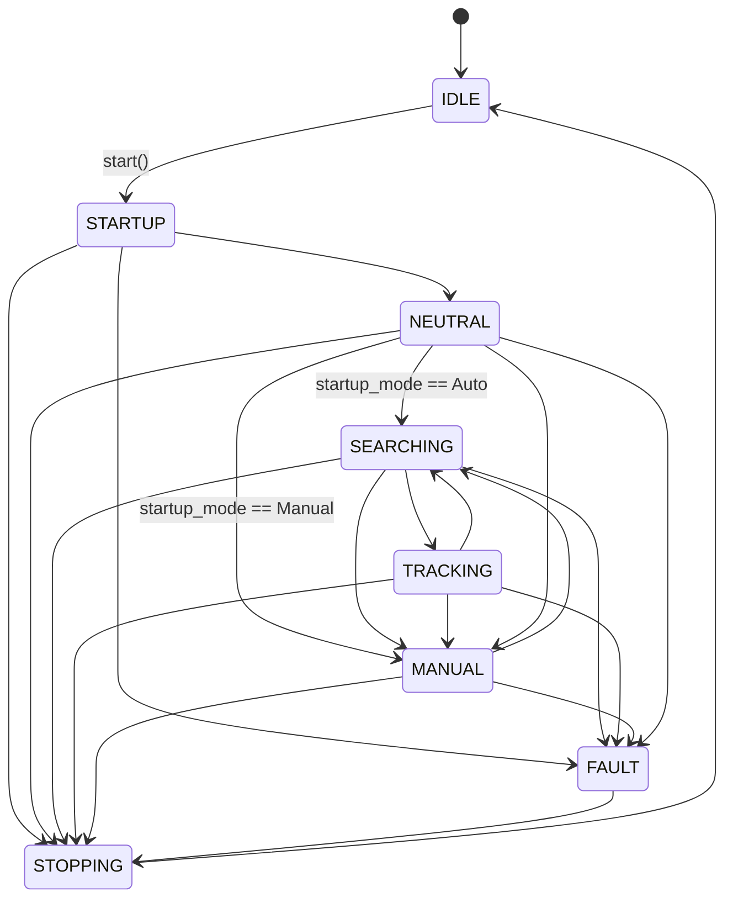
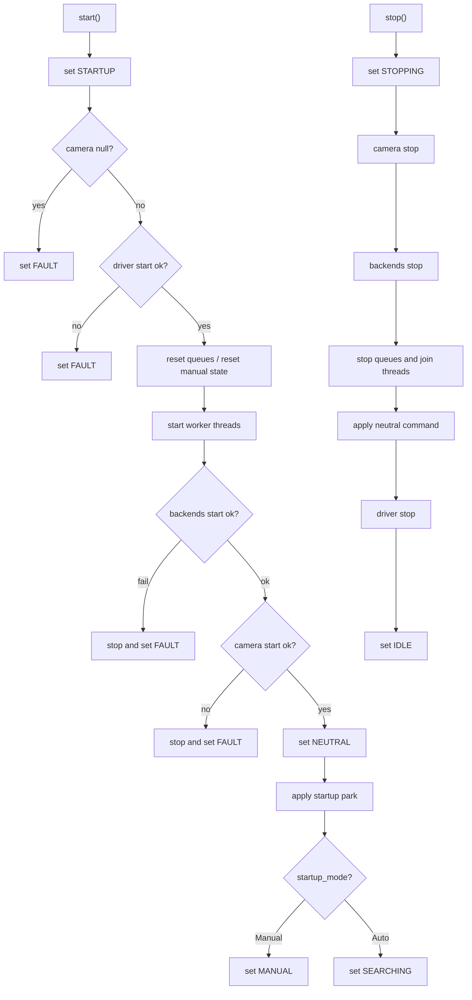
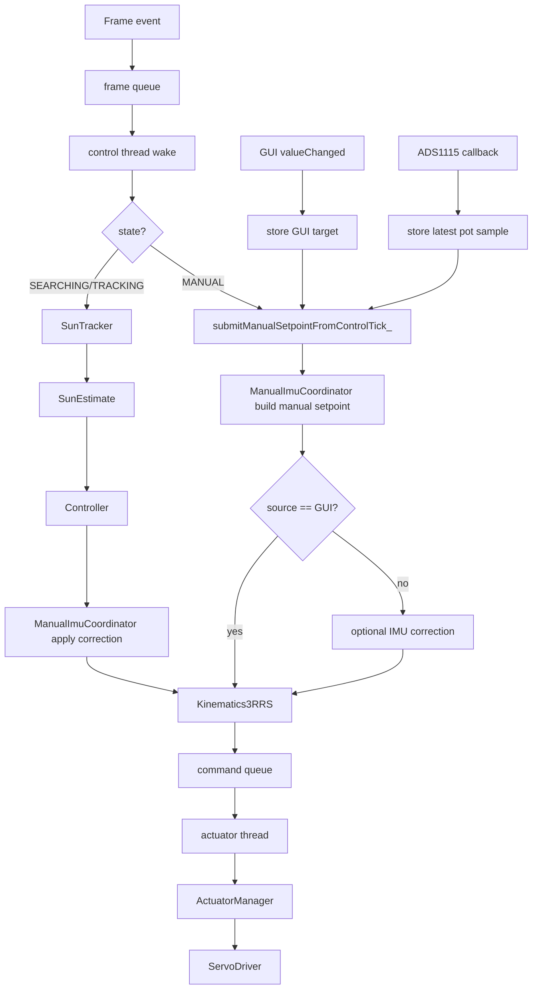

# System State Machine

This document defines the runtime behaviour of the system as a state machine. It describes the implemented execution flow, including all states, transitions, and operational behaviour.

---

## 1. States

| State | Meaning | Outputs |
|---|---|---|
| IDLE | System not running | No motion |
| STARTUP | Initialisation in progress | Startup sequence in progress |
| NEUTRAL | Transitional safe positioning state | Configured startup park applied |
| SEARCHING | Target not confidently detected | Continuous automatic processing with safe behaviour |
| TRACKING | Target detected with sufficient confidence | Normal closed-loop automatic updates |
| MANUAL | User controls setpoint | Manual target is applied continuously through the control thread |
| STOPPING | Shutdown in progress | Controlled stop sequence |
| FAULT | Failure state | Outputs stopped or held safe |

---

## 2. Transition Rules

| From | To | Trigger |
|---|---|---|
| IDLE | STARTUP | `start()` called |
| STARTUP | FAULT | camera null, driver start failure, manual backend failure, or camera start failure |
| STARTUP | NEUTRAL | successful initialisation |
| NEUTRAL | SEARCHING | startup park applied and `startup_mode == Auto` |
| NEUTRAL | MANUAL | startup park applied and `startup_mode == Manual` |
| SEARCHING | TRACKING | confidence ≥ threshold |
| TRACKING | SEARCHING | confidence < threshold |
| SEARCHING | MANUAL | `enterManual()` |
| TRACKING | MANUAL | `enterManual()` |
| NEUTRAL | MANUAL | `enterManual()` |
| MANUAL | SEARCHING | `exitManual()` |
| SEARCHING | STOPPING | `stop()` called |
| TRACKING | STOPPING | `stop()` called |
| MANUAL | STOPPING | `stop()` called |
| NEUTRAL | STOPPING | `stop()` called |
| STARTUP | STOPPING | `stop()` during startup |
| FAULT | STOPPING | `stop()` called |
| STOPPING | IDLE | shutdown complete |
| ANY ACTIVE STATE | FAULT | critical runtime failure |

---

## 3. State Descriptions

### IDLE

The system is inactive.

- camera is not running
- worker threads are not active
- no actuator commands are produced

### STARTUP

Initialisation phase.

- system marked as running
- camera null check performed
- actuator driver started
- queues reset
- worker threads started
- backend coordinator started
- camera streaming started
- failures lead to FAULT

### NEUTRAL

Short transitional state.

- startup park is applied using predefined actuator values
- transitions to SEARCHING (default) or MANUAL (if `startup_mode == Manual`)

### SEARCHING

System is active but target confidence is low.

- frames are processed continuously
- full automatic pipeline remains active
- motion remains bounded
- transitions to TRACKING when confidence increases

### TRACKING

System operates in closed-loop tracking mode.

- each frame triggers full automatic processing path
- controller, correction, kinematics, and actuator stages are active
- continuous actuator updates
- transitions back to SEARCHING if confidence drops

### MANUAL

User-controlled mode.

- activated via `enterManual()` or by `startup_mode == Manual`
- automatic controller updates are disabled
- the control thread still wakes on the normal frame/control cadence
- GUI slider movement updates the stored GUI target continuously
- ADS1115 callbacks update the latest potentiometer sample
- the control thread builds the current manual setpoint and forwards it downstream
- the downstream path remains `Kinematics3RRS → ActuatorManager → ServoDriver`

Two manual command sources are supported:

- `ManualCommandSource::Gui`
- `ManualCommandSource::Pot`

By default, GUI manual mode does not apply live IMU correction. This avoids fighting the operator-selected manual target with IMU noise.

### STOPPING

Shutdown sequence.

- system marked as not running
- camera stopped
- backend coordinator stopped
- frame and command queues stopped
- processing threads joined
- neutral command applied
- driver stopped
- transitions to IDLE

### FAULT

Failure state.

- triggered by null camera, driver failure, backend failure, camera start failure, or invalid kinematics result
- actuator commands are halted or suppressed
- system requires explicit stop to recover

---

## 4. Runtime State Graph

---

## 5. Startup and Shutdown Flow

---

## 6. Automatic vs Manual Processing

---

## 7. Implementation Notes

- automatic processing runs only in SEARCHING and TRACKING
- manual callbacks directly drive downstream kinematics work
- manual commands are continuous because the control thread consumes manual state on each control tick
- GUI manual mode is continuous while dragging the slider
- GUI manual mode does not use Qt timers as a control timing source
- invalid kinematic results prevent actuation and trigger FAULT
- state transitions are explicit and centrally controlled in `SystemManager`
