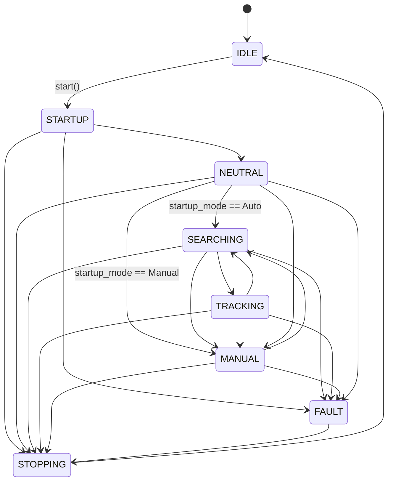
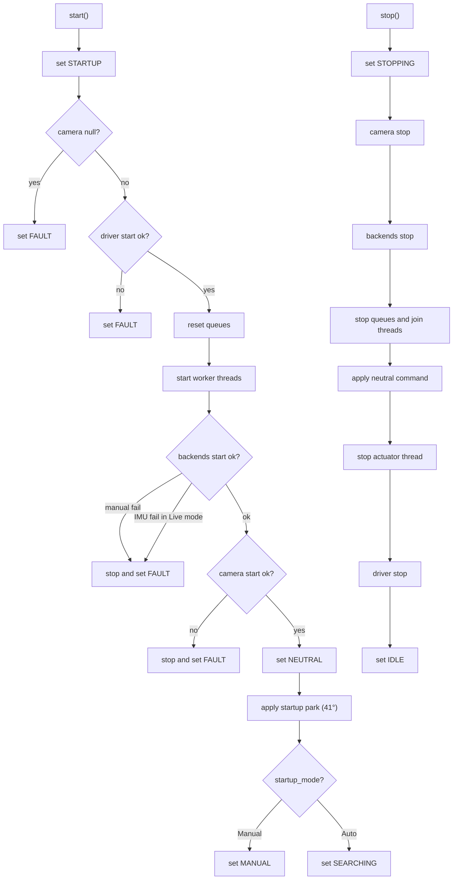
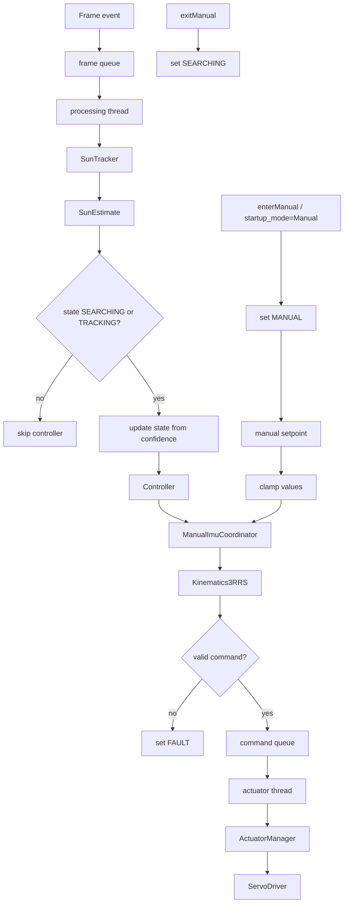

# System State Machine

This document defines the runtime behaviour of the system as a state machine. It describes the implemented execution flow, including all states, transitions, and operational behaviour.

---

## 1. States

| State | Meaning | Outputs |
|---|---|---|
| IDLE | System not running | No motion |
| STARTUP | Initialisation in progress | Startup sequence in progress |
| NEUTRAL | Transitional safe positioning state | Configured startup park applied |
| SEARCHING | Target not confidently detected | Continuous processing with safe behaviour |
| TRACKING | Target detected with sufficient confidence | Normal closed-loop updates |
| MANUAL | User controls setpoint | Manual input mapped to actuator path |
| STOPPING | Shutdown in progress | Controlled stop sequence |
| FAULT | Failure state | Outputs stopped or held safe |

---

## 2. Transition Rules

| From | To | Trigger |
|---|---|---|
| IDLE | STARTUP | `start()` called |
| STARTUP | FAULT | camera null, driver start failure, manual backend failure, or camera start failure |
| STARTUP | NEUTRAL | successful initialisation |
| NEUTRAL | SEARCHING | startup park applied and `startup_mode == Auto` (default) |
| NEUTRAL | MANUAL | startup park applied and `startup_mode == Manual` |
| SEARCHING | TRACKING | confidence ≥ threshold |
| TRACKING | SEARCHING | confidence < threshold |
| SEARCHING | MANUAL | `enterManual()` |
| TRACKING | MANUAL | `enterManual()` |
| NEUTRAL | MANUAL | `enterManual()` |
| MANUAL | SEARCHING | `exitManual()` |
| SEARCHING | STOPPING | `stop()` called |
| TRACKING | STOPPING | `stop()` called |
| MANUAL | STOPPING | `stop()` called |
| NEUTRAL | STOPPING | `stop()` called |
| STARTUP | STOPPING | `stop()` during startup |
| FAULT | STOPPING | `stop()` called |
| STOPPING | IDLE | shutdown complete |
| ANY ACTIVE STATE | FAULT | critical runtime failure |

Reacquisition behaviour is handled through **TRACKING ↔ SEARCHING** based on confidence threshold.

The NEUTRAL → MANUAL path is triggered by startup configuration (`AppConfig::StartupMode::Manual`), not by a user call. This is distinct from the runtime `enterManual()` path available from SEARCHING, TRACKING, and NEUTRAL.

---

## 3. State Descriptions

### IDLE

The system is inactive.

- camera is not running
- worker threads are not active
- no actuator commands are produced

### STARTUP

Initialisation phase.

- system marked as running
- camera null check performed
- actuator driver started
- queues reset
- worker threads started
- backend coordinator started (ADS1115, MPU6050)
- camera streaming started
- any failure leads to FAULT

### NEUTRAL

Short transitional state.

- startup park is applied using predefined actuator values (default: 41°)
- direct actuator command is issued
- no kinematic solve is performed
- transitions to SEARCHING (default) or MANUAL (if `startup_mode == Manual`)

### SEARCHING

System is active but target confidence is low.

- frames are processed continuously
- full pipeline remains active
- motion remains bounded
- transitions to TRACKING when confidence increases

### TRACKING

System operates in closed-loop tracking mode.

- each frame triggers full processing path
- control, kinematics, and actuator stages are active
- continuous actuator updates
- transitions back to SEARCHING if confidence drops

### MANUAL

User-controlled mode.

- activated via `enterManual()` or by `startup_mode == Manual` at startup
- automatic control updates are disabled
- user input generates platform setpoints via potentiometers (`ManualCommandSource::Pot`) or GUI (`ManualCommandSource::Gui`)
- setpoints are bounded before use
- data still flows through kinematics and actuator stages
- exits via `exitManual()` to SEARCHING

### STOPPING

Shutdown sequence.

- system marked as not running
- camera stopped
- backend coordinator stopped
- frame and command queues stopped
- processing threads joined
- neutral command applied through kinematics
- actuator thread stopped
- driver stopped
- transitions to IDLE

### FAULT

Failure state.

- triggered by null camera, driver failure, backend failure, camera start failure, or invalid kinematics result
- actuator commands are halted or suppressed
- no further commands propagated
- system requires explicit stop to recover

---

## 4. Runtime State Graph

---

## 5. Startup and Shutdown Flow

---

## 6. Automatic vs Manual Processing

---

## 7. Implementation Notes

- startup neutral positioning uses direct actuator commands (no kinematics)
- shutdown neutral positioning uses kinematic mapping
- automatic processing runs only in SEARCHING and TRACKING
- manual commands bypass automatic control but follow the same actuator path from `ManualImuCoordinator` onward
- invalid kinematic results prevent actuation and trigger FAULT
- state transitions are explicit and centrally controlled in `SystemManager`
- no implicit transitions or hidden state changes
- IMU backend failure in Shadow mode degrades gracefully; failure in Live mode triggers FAULT