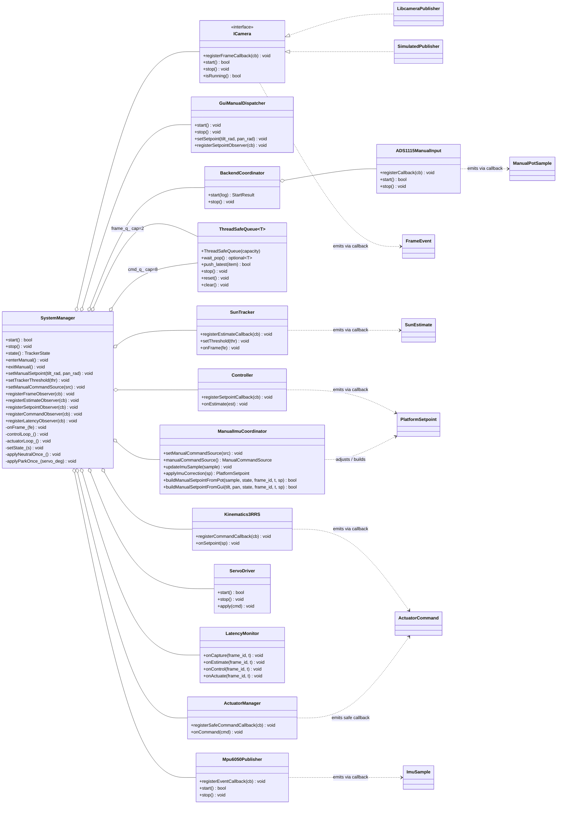
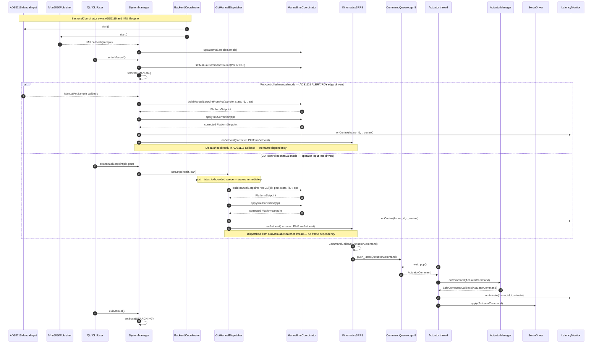
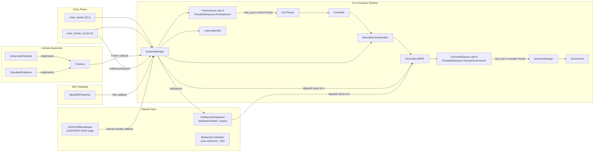
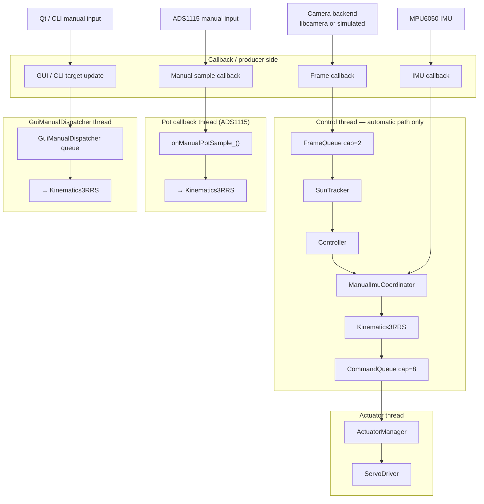

# System Architecture

## Overview

The system is structured as a staged, event-driven pipeline in Linux userspace. Frame acquisition, tracking, control, kinematic mapping, and actuator output are separated into distinct classes so that each stage has a clear responsibility and a bounded interface. This is consistent with the taught architecture of sensor events propagating through callbacks and typed data transformations to control outputs.

The implemented automatic processing path is:

**ICamera → SunTracker → Controller → ManualImuCoordinator → Kinematics3RRS → ActuatorManager → ServoDriver**

`SystemManager` orchestrates this pipeline and manages runtime state. `BackendCoordinator` owns hardware backend lifecycle. `GuiManualDispatcher` provides the event-driven GUI manual path. `SystemFactory` assembles the runtime graph.

This class structure is stronger than a monolithic alternative because it separates:

- sensor acquisition from estimation
- estimation from control
- control from mechanism-specific mapping
- mechanism mapping from actuator safety conditioning
- actuator conditioning from final hardware output
- runtime orchestration from backend implementation details

That separation improves maintainability, reduces coupling, and makes the realtime event flow explicit.

---

## Architectural Rationale

The core design decision is to preserve a forward-only event path through specialised classes instead of building one large tracker class. In this repository, each stage transforms one well-defined form of data into the next.

For automatic tracking:

- the camera backend emits frames
- the tracker estimates target position and confidence
- the controller converts that estimate into a platform command
- the manual/IMU coordination layer applies optional correction
- the kinematics layer maps platform motion into actuator-space commands
- the actuator manager applies command conditioning and output safety policy
- the servo driver performs final calibrated output to the physical device

For manual mode, both input paths are independently event-driven:

**Pot-driven manual:** ADS1115 ALERT/RDY GPIO edge → `onManualPotSample_()` → setpoint built and dispatched directly to `Kinematics3RRS`. Timing is driven by the ADS1115 conversion rate, independent of camera frames.

**GUI-driven manual:** Qt slider → `setManualSetpoint()` → `GuiManualDispatcher::setSetpoint()` → push to bounded queue → `GuiManualDispatcher` worker thread wakes immediately → setpoint built via `ManualImuCoordinator` and dispatched directly to `Kinematics3RRS`. Timing is driven by operator input rate, independent of camera frames.

The control thread handles only the automatic path. It is not involved in either manual path.

This staged structure is appropriate because the taught approach is event-driven userspace code built around callbacks, blocking waits, and clean class interfaces rather than polling loops or single-threaded delay-based control.

---

## Diagram 1 — UML Class Diagram

---

## Diagram 2.1 — Sequence Diagram — Automatic Runtime Pipeline

---

## Diagram 2.2 — Sequence Diagram — Manual Input + IMU Update Paths

---

## Diagram 3 — Component Diagram

---

## Diagram 4 — Threaded Event Architecture

---

## Component Responsibilities

### SystemManager

Coordinates runtime execution, manages threads, processes incoming events, and controls system state. Manual timing is fully delegated: potentiometer commands dispatch directly from the ADS1115 callback, and GUI commands dispatch from `GuiManualDispatcher`. The control thread handles only the automatic pipeline.

### BackendCoordinator

Owns the lifecycle of optional hardware backends: ADS1115 manual input and MPU-6050/ICM-20600 IMU. Starts, stops, and owns I2C/GPIO resources independently of pipeline orchestration.

### GuiManualDispatcher

Owns a dedicated worker thread and bounded freshest-data queue for GUI manual setpoints. When `setManualSetpoint()` is called, the dispatcher wakes immediately and dispatches the setpoint to `Kinematics3RRS` without depending on camera-frame timing.

### ICamera and Camera Backends

Provide frame acquisition. Multiple implementations can be used without affecting downstream processing.

### SunTracker

Processes image data and produces a target estimate including position and confidence.

### Controller

Transforms the target estimate into a platform-level motion command.

### ManualImuCoordinator

Handles manual input ownership and optional IMU-based adjustments. It builds manual setpoints and applies IMU correction where allowed by mode/source policy.

### Kinematics3RRS

Maps platform motion commands into actuator-specific commands based on mechanism geometry.

### ActuatorManager

Applies conditioning to actuator commands such as clamping and rate limiting to ensure safe output.

### ServoDriver and PCA9685

Convert actuator commands into hardware signals and communicate with the PWM controller.

### Input Devices

- `ADS1115ManualInput` provides potentiometer-based manual control input
- `Mpu6050Publisher` provides IMU data for orientation feedback

---

## Architectural Summary

The system is built as a pipeline of independent processing stages connected through well-defined interfaces. Each stage transforms data and passes it forward without direct knowledge of internal details of other components.

This structure enables:

- predictable data flow
- clear separation between computation and hardware access
- safe multi-threaded execution
- straightforward extension and modification of individual stages

The inter-thread queues are intentionally bounded:

- Frame queue capacity is small (2) to minimise latency and prevent stale frames accumulating.
- Command queue capacity is larger (8) to absorb short bursts without dropping actuator updates prematurely.

Both queues use a latest-wins policy, ensuring that the system prioritises current data while maintaining bounded memory and predictable behaviour.