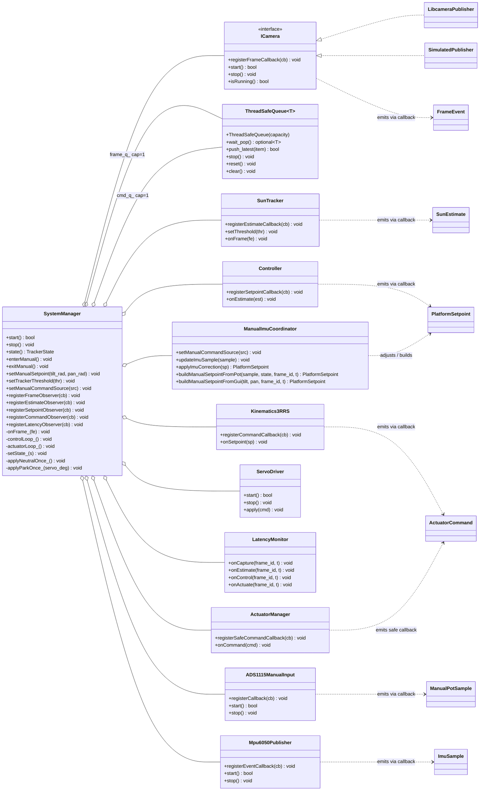
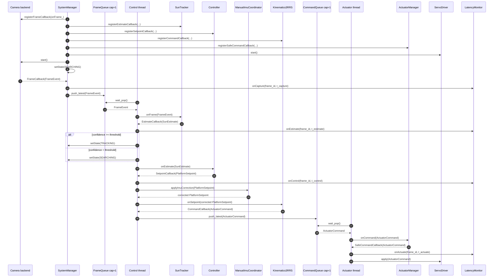
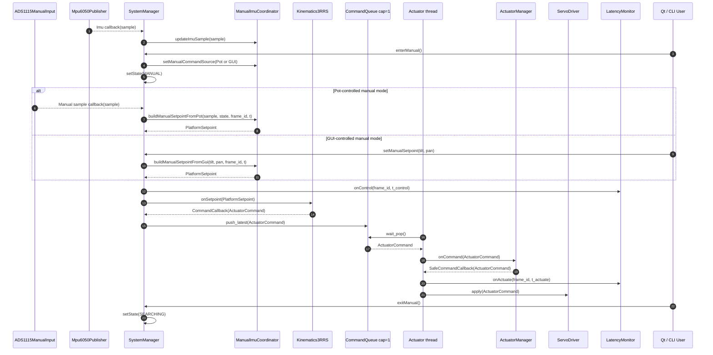
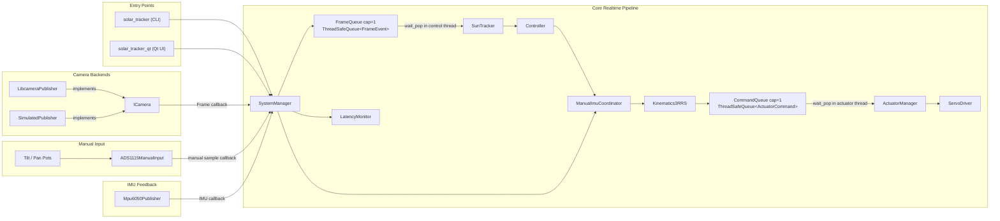
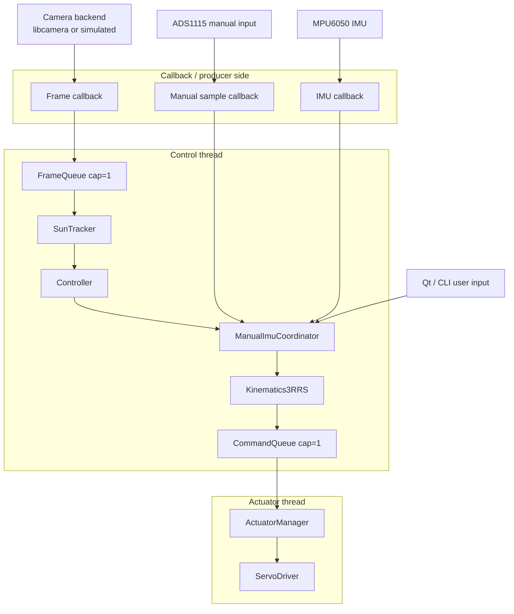

# System Architecture

## Overview

The system is structured as a staged, event-driven pipeline in Linux userspace. Frame acquisition, tracking, control, kinematic mapping, and actuator output are separated into distinct classes so that each stage has a clear responsibility and a bounded interface. This is consistent with the taught ENG5220 architecture of sensor events propagating through callbacks and typed data transformations to control outputs.

The implemented processing path is:

**ICamera → SunTracker → Controller → ManualImuCoordinator → Kinematics3RRS → ActuatorManager → ServoDriver**

`SystemManager` orchestrates this pipeline, manages runtime state, starts and stops backends, and coordinates the worker threads. `SystemFactory` acts as the composition root that assembles the concrete runtime graph.

This class structure is stronger than a monolithic alternative because it separates:

- sensor acquisition from estimation
- estimation from control
- control from mechanism-specific mapping
- mechanism mapping from actuator safety conditioning
- actuator conditioning from final hardware output
- runtime orchestration from backend implementation details

That separation improves maintainability, reduces coupling, and makes the realtime event flow explicit.

---

## Architectural Rationale

The core design decision is to preserve a forward-only event path through specialised classes instead of building one large tracker class. In this repository, each stage transforms one well-defined form of data into the next:

- the camera backend emits frames
- the tracker estimates target position and confidence
- the controller converts that estimate into a platform command
- the manual/IMU coordination layer adjusts command ownership and optional correction
- the kinematics layer maps platform motion into actuator-space commands
- the actuator manager applies command conditioning and output safety policy
- the servo driver performs final calibrated output to the physical device

This staged structure is appropriate for ENG5220 because the taught approach is event-driven userspace code built around callbacks, blocking waits, and clean class interfaces rather than polling loops or single-threaded delay-based control.

---

## Diagram 1 — UML Class Diagram

---

## Diagram 2.1 — Sequence Diagram — Automatic Runtime Pipeline

---

## Diagram 2.2 — Sequence Diagram — Manual Input + IMU Update Paths

---
## Diagram 3 — Component Diagram

---
## Diagram 4 — Threaded Event Architecture

---

## Component Responsibilities

### SystemManager

Coordinates runtime execution, manages threads, processes incoming events, and controls system state. It connects all pipeline stages and ensures correct execution order.

### ICamera and Camera Backends

Provide frame acquisition. Multiple implementations can be used without affecting downstream processing.

### SunTracker

Processes image data and produces a target estimate including position and confidence.

### Controller

Transforms the target estimate into a platform-level motion command.

### ManualImuCoordinator

Handles manual input and optional IMU-based adjustments. It determines command ownership and applies corrections where required.

### Kinematics3RRS

Maps platform motion commands into actuator-specific commands based on mechanism geometry.

### ActuatorManager

Applies conditioning to actuator commands such as clamping and rate limiting to ensure safe output.

### ServoDriver and PCA9685

Convert actuator commands into hardware signals and communicate with the PWM controller.

### Input Devices

- `ADS1115ManualInput` provides potentiometer-based manual control input
- `Mpu6050Publisher` provides IMU data for orientation feedback

---

## Architectural Summary

The system is built as a pipeline of independent processing stages connected through well-defined interfaces. Each stage transforms data and passes it forward without direct knowledge of internal details of other components.

This structure enables:

- predictable data flow
- clear separation between computation and hardware access
- safe multi-threaded execution
- straightforward extension and modification of individual stages