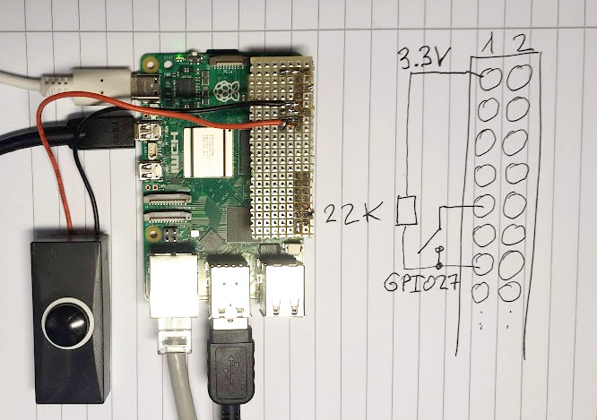

# C++ libgpiod event coding example for the Raspberry PI

This code demonstrates how a rising or falling edge at a
GPIO pin wakes up a thread which then runs a callback.
This then allows the communication between classes where a class subscribes
to a callback interface. `std::function` and lambda
functions are used to glue together publishers and subscribers.

## Prerequisites

You need Debian `trixie` on your Raspberry PI.

Install the libgpiod v2 development package:

```
apt-get install libgpiod-dev
```

## How to compile

The build system is `cmake`:

```
cmake .
make
```

## How to use it?

Please check out the example in the subdir example: `gpio_printer`.
This detects rising and falling edges at GPIO pin 27. 
It registers the method `hasEvent` as a callback in the class `EventPrinter`.
To play with it just
connect a push button to GPIO27 with a pullup resistor.



Press the button and you should see:
```
Press any key to stop.
Falling
Rising!
Falling
Rising!
Falling
```

## Use the gpioevent library in your own project

You can install it with:
```
sudo make install
```

Then just include `gpioevent.h` and link either the dynamic `gpioevent`
or static `gpioevent_static` library.

See the `CMakeLists.txt` in the example folder.

## Credit

Bernd Porr, bernd.porr@glasgow.ac.uk
